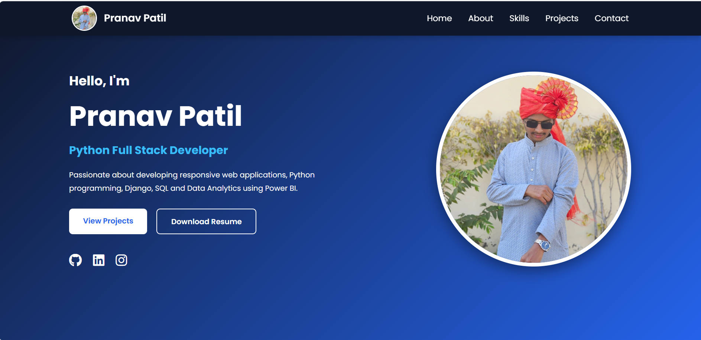
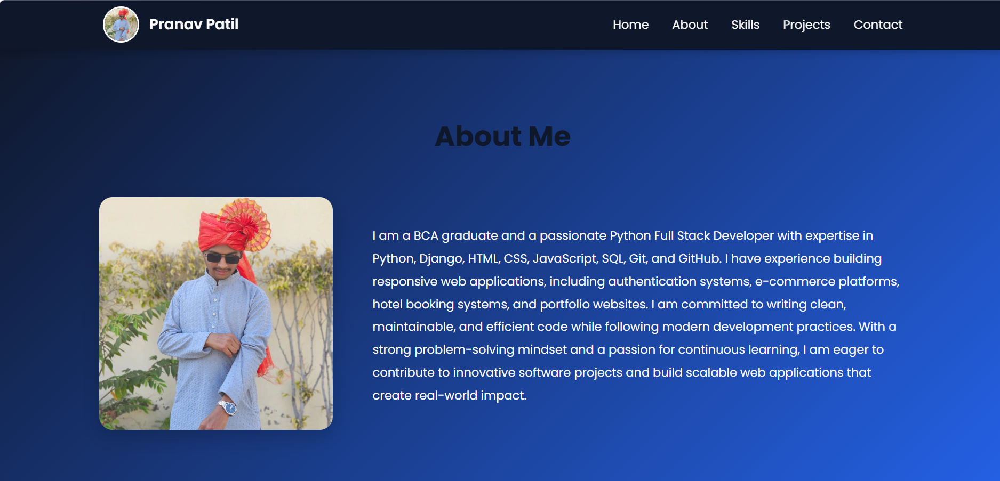
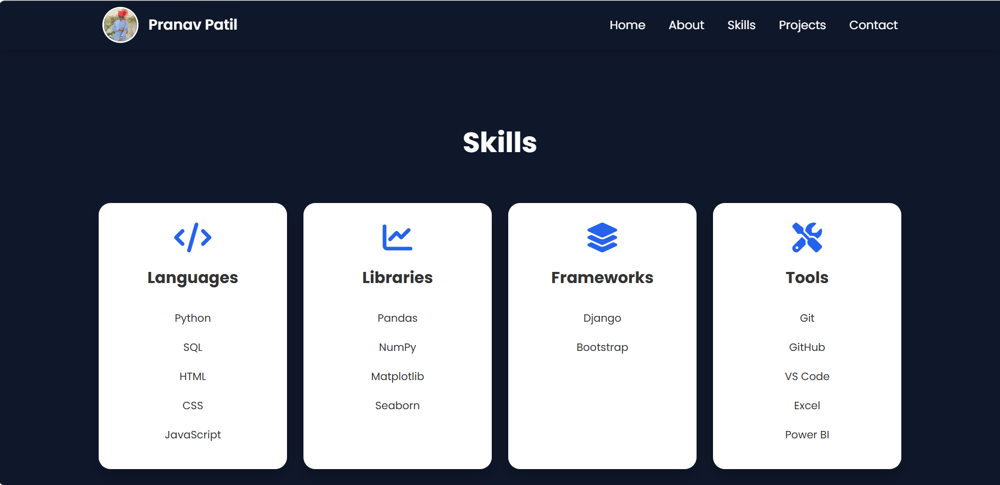
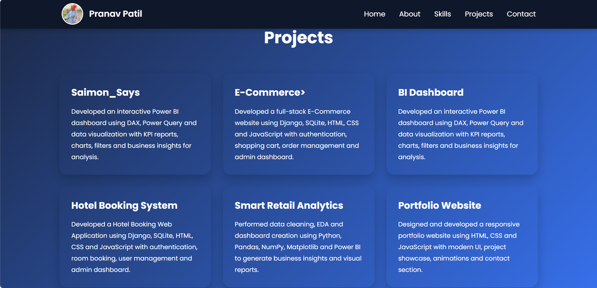

# 💼 Portfolio Backend (Django)

A Django-powered backend for my personal portfolio website. It manages portfolio content, serves templates and static files, and includes a contact form that stores visitor messages in the database.

---

## 🚀 Features

- Responsive Portfolio Website
- Django Backend
- Contact Form
- Store Messages in Database
- Static Image Support
- Clean UI
- Easy to Customize

---

# 🏠 Home Page

<p align="center">
  
</p>

---

# 👨‍💻 About Page

<p align="center">
  
</p>

---

# 🛠 Skills Section

<p align="center">
  
</p>

---

# 📂 Projects Section

<p align="center">
  
</p>

---


## 🛠 Tech Stack

- Python
- Django
- HTML5
- CSS3
- JavaScript
- SQLite3
- Git
- GitHub

---

## 📁 Project Structure

```text
portfolio_backend/
│
├── portfolio/
│   ├── static/
│   │   ├── css/
│   │   ├── images/
│   │   │   ├── home-page.png
│   │   │   ├── about-page.png
│   │   │   ├── skills.png
│   │   │   ├── projects.png
│   │   │   └── Me.jpeg
│   ├── templates/
│   ├── views.py
│   ├── urls.py
│   └── models.py
│
├── portfolio_backend/
├── manage.py
├── db.sqlite3
└── README.md
```

---

## ⚙️ Installation

Clone the repository

```bash
git clone https://github.com/Pranavs-hub/portfolio_backend.git
```

Move into the project

```bash
cd portfolio_backend
```

Create a virtual environment

```bash
python -m venv venv
```

Activate it

**Windows**

```bash
venv\Scripts\activate
```

Install dependencies

```bash
pip install -r requirements.txt
```

Run migrations

```bash
python manage.py migrate
```

Start the server

```bash
python manage.py runserver
```

Open in your browser:

```
http://127.0.0.1:8000/
```

---

## 👨‍💻 Author

**Pranav Rajagouda Patil**

Python Full Stack Developer

Belagavi, Karnataka